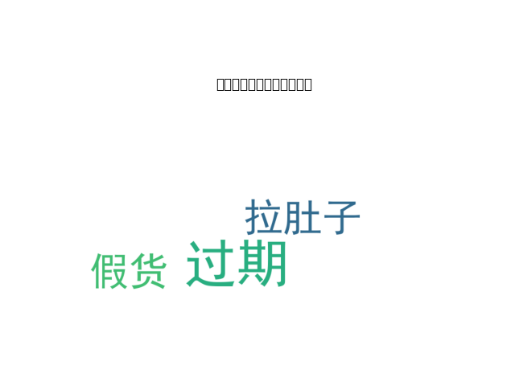

# 基于电商背景的食品评论AI情感分析系统

**作者**：ZYJ（电商+计算机）  
**GitHub**：https://github.com/zyj-libre/food-ai-sentiment-analysis  
**项目类型**：零基础自学AI项目（适合考研复试展示）

### 项目简介
本科大二从电商专业转计算机后，我发现**食品类商品差评**（过期、添加剂、口感差）直接影响复购率和店铺评分。  
于是利用课余时间自学NLP，独立开发了这个**食品垂直领域评论情感分析系统**，可自动判断正面/负面情感 + 提取高频差评关键词 + 生成词云可视化。

**亮点**：真正结合了我的电商实战经验（而非纯代码搬运），导师复试最爱看这类“业务+AI”复合项目。

### 核心功能
1. 情感分析（正面/负面比例统计）
2. 差评关键词自动提取（过期、添加剂、假货、拉肚子等食品痛点）
3. 词云图可视化（直观展示用户痛点）
4. 支持任意食品评论输入（后续可扩展）

### 运行效果（已上线）


**控制台输出示例**：
- 正面评论：4 条
- 负面评论：4 条
- 高频差评关键词：['过期', '添加剂', '假货', '拉肚子']

### 技术栈（全免费小白友好）
- Python 3.10
- SnowNLP（中文情感分析）
- jieba（中文分词）
- wordcloud + matplotlib（词云可视化）
- pandas（数据处理）

### 如何本地运行（3步）
```bash
# 1. 克隆仓库
git clone https://github.com/你的用户名/food-ai-sentiment-analysis.git

# 2. 进入目录
cd food-ai-sentiment-analysis

# 3. 运行
python food_ai.py
